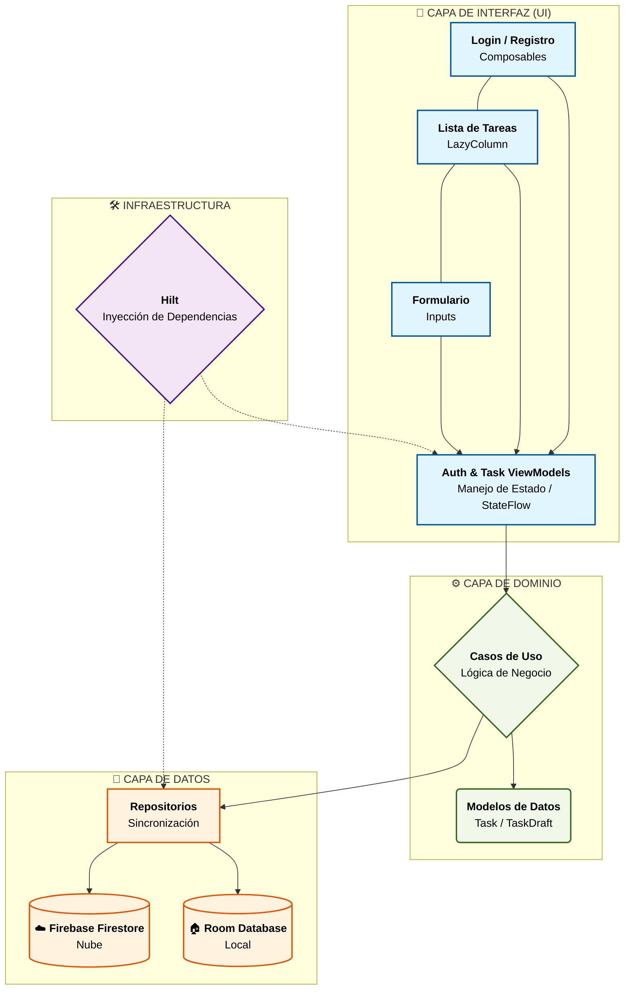

# Gestor Personal de Tareas (Taller Sena)

## Descripción
Aplicación Android robusta desarrollada con **Kotlin** y **Jetpack Compose**. Implementa una solución completa de gestión de tareas con sincronización en la nube y persistencia local para borradores.

## Integrantes
- Juan Diego Cardona

## 🏗️ Arquitectura
La aplicación sigue los principios de **Clean Architecture** y el patrón de diseño **MVVM**:

- **Capa UI (Compose)**: Pantallas reactivas que observan el estado mediante `StateFlow`.
- **Capa Domain**: Contiene la lógica de negocio pura, modelos y Casos de Uso (`UseCases`).
- **Capa Data**: Implementación de repositorios que coordinan Firestore (Remoto) y Room (Local).
- **DI (Hilt)**: Inyección de dependencias centralizada para desacoplamiento total.

### 🏗️ Arquitectura del Sistema
El proyecto utiliza una arquitectura de **Capas Limpias (Clean Architecture)** con el patrón **MVVM**. Este diagrama muestra cómo fluye la información:

> **Nota**: Este diagrama se genera dinámicamente. Al subirlo a GitHub, verás rectángulos de colores (Azul para UI, Verde para Dominio, Naranja para Datos) que explican la separación de responsabilidades.

## 🛠️ Tecnologías
- **Firebase Auth**: Autenticación segura de usuarios.
- **Cloud Firestore**: Almacenamiento remoto en tiempo real.
- **Room Database**: Manejo de borradores sin conexión.
- **Hilt**: Inyección de dependencias.
- **Navigation Compose**: Navegación entre pantallas.
- **Corrutinas & Flow**: Manejo de asincronía.

## 📊 Matriz de Pruebas (Registro de Ejecución)

| ID | Caso de Prueba | Resultado Esperado | Estado |
| :--- | :--- | :--- | :--- |
| **P01** | Registro de usuario | Usuario creado con éxito en Firebase | ✅ Exitoso |
| **P02** | Correo duplicado | Muestra error: "Correo ya en uso" | ✅ Exitoso |
| **P03** | Credenciales inválidas | Bloquea acceso con mensaje en español | ✅ Exitoso |
| **P04** | Persistencia de sesión | Inicia directo en la lista si hay sesión | ✅ Exitoso |
| **P05** | Cierre de sesión | Limpia historial (RF03) y va al Login | ✅ Exitoso |
| **P06** | CRUD Firestore | Cambios reflejados en la consola web | ✅ Exitoso |
| **P07** | Aislamiento de datos | Usuario B no puede ver tareas de A | ✅ Exitoso |
| **P08** | Borradores locales | Borrador persiste tras cerrar la app | ✅ Exitoso |
| **P09** | Publicación exitosa | Tarea se crea en nube y se borra de local | ✅ Exitoso |
| **P10** | Fallo de conexión | Borrador se mantiene si falla el envío | ✅ Exitoso |

## 🚀 Configuración
1. Clonar el repositorio.
2. Asegurar que el archivo `app/google-services.json` esté presente.
3. Compilar el proyecto en Android Studio (Ladybug+).
4. El archivo APK se encuentra en la carpeta de entregables del proyecto.
